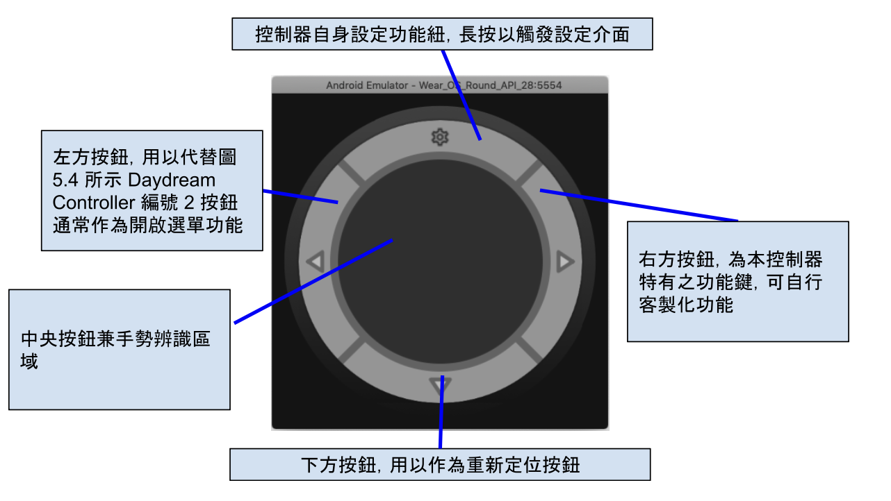
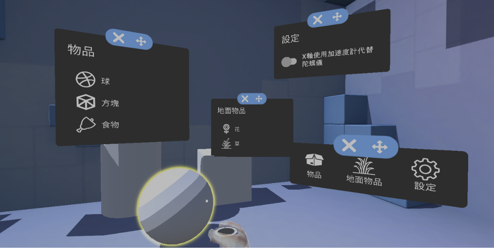
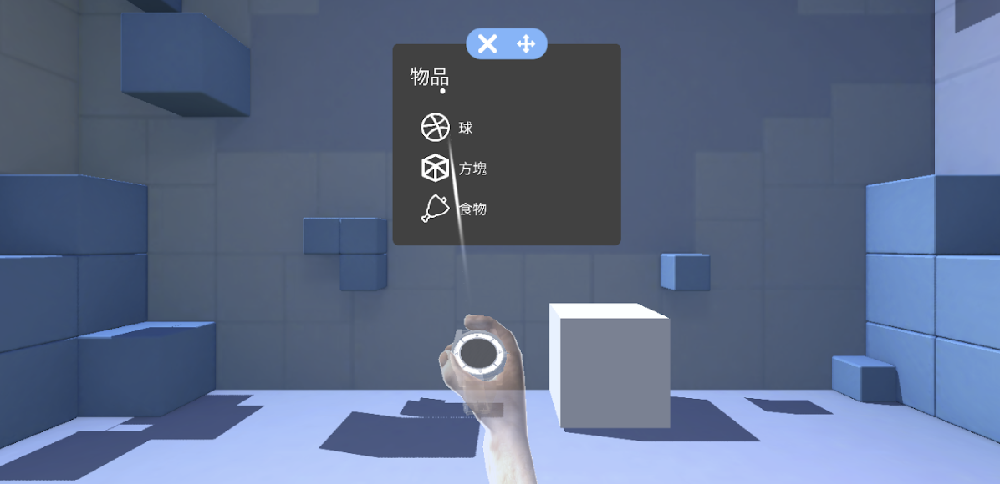
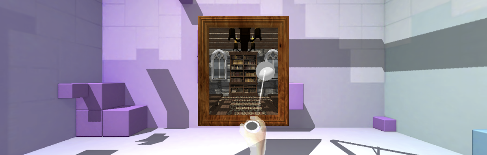
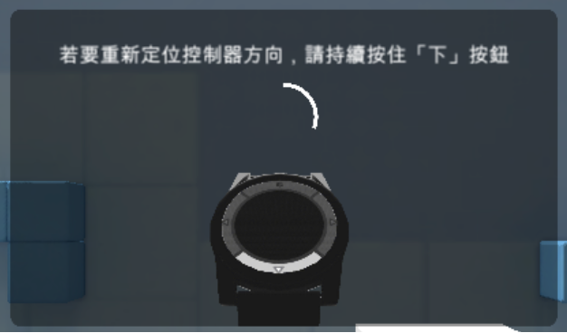

A 3DOF Google VR implementation on iOS with Android device controller.
---
The project source of the master thesis - [Smartwatch-based 3DOF Motion Controller and Its Effect - Take“Spatial Puzzle VR Game”as an Example](https://ndltd.ncl.edu.tw/cgi-bin/gs32/gsweb.cgi?o=dnclcdr&s=id=%22107TIT0064A011%22.&searchmode=basic)

# Feature
- 3DOF moven tracking on any ARKit compatible device
- Turns any Android Device into a 3DOF hand tracking controller. (Recommand using Google Wear)
- Gesture tracking and controller implementation
- Virtual Cusor implementation 

# Project structure

- ~~ProjectWatchHoloKit~~ 
    A HoloKit project, Deprecated
- ~~ProjectWatchVR~~
    Not in use anymore, Deprecated
- ProjectWatchVR_Unity
    iOS app sample project
- ProjectWatchVR_UnityWear
    A sample prject to make a Unity Project run on a Android Wear, deprecate due to the Unity App is too heavy to an Android Wear device
- Wear
    The hand tracking controller android project, default is a Android Wear

# Usage

## APK

Download the pre-built apk and install in your android device, recommand using a android wear

- [Android Wear](./apk/android-wear.apk)
- [Android Phone](./apk/android-phone.apk)

## Build the iOS sample from source

Since the iOS app require your apple id to sign the app, there is require to build the iOS sample yourself

- Using the Unity to open the unity project `/ProjectWatchVR_Unity`
- Select the target platform to iOS in your Unity
- Build the iOS project, you will get a XCode project
- Open the XCode project and run!
(If you got an error message in XCode when build like this `Cannot initialize a parameter of type 'id<NSCopying> _Nonnull' with an rvalue of type 'Class'` see the [solution](https://forums.developer.apple.com/forums/thread/698312) here!)

### Setting connection
The data controller data is sent via WebSocket

- In the android app, long-press the top button, the setting menu will show
- Setup the iOS device IP on the setting view, the iOS device and Android device should in the same network

## How to...

- Make the `Wear` project to a normal android project?
    Just delete all android wear relative feature in `AndroidManifes.xml` and turn all `WearableActivity` into `Activity`, (you may reqire to fix some small compile error yourself)

## Screenshots

## Special Thanks

This project is based on those great project, without them the job will not possible be done!

- [juanpomares/Mobile-projects](https://github.com/juanpomares/Mobile-projects/)
- [sensor-fusion-demo](https://github.com/apacha/sensor-fusion-demo)
- [cakeslice/Outline-Effect](https://github.com/cakeslice/Outline-Effect)